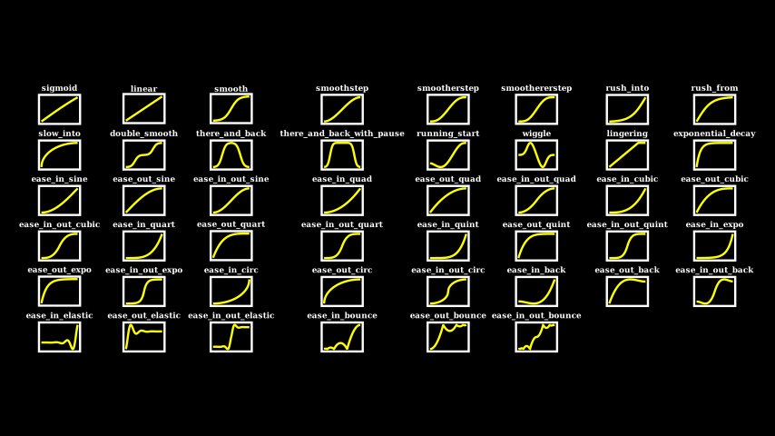

# Manim Commands

## Activate Virtual Environment

Have to run this line to activate the virtual environment in a shell so you can write commands involving `manim` in the terminal:

`source /Users/rjf5371/manimations/.venv/bin/activate`

## Starting a new project
Start by creating a new folder:

`manim init project my-project --default`

The `my-project` folder is the root folder for your project. It contains all the files that Manim needs to function, as well as any output that your project produces.

## Using VS Code Buttons
This button in VS Code is how you get the Manim Sideview to show for a particular class in your script.


If you don't see it, try right clicking on the play symbol at the top right of your editor and making sure "Manim: Runs a Sideview" is checked:


In the Manim Sideview tab, you can also change which class appears by clicking the following button and selecting the intended class:


## Preview/Animate a Scene as .MP4 (or other)

In your terminal (standalone): 

Low Quality: `manim -pql <file> <scene>`
High Quality: `manim -pgh <file> <scene>`

`-p` tells manim to play the scene after being rendered. Alternatively, `-f` just opens the file location in the Finder. Both of these flags are optional. 

Additionally, `-s` would ask for the last frame of a scene (quicker to output). Write this as a separate flag.

Alternatively, `-a` renders all scenes.

- `-ql`: low (854x480 15FPS)
- `-qm`: medium (1280x720 30FPS)
- `-qh`: high (1920x1080 60FPS)
- `-qp`: 2k (2560x1440 60FPS)
- `-qk`: 4k quality (3840x2160 60FPS)

In Manim Community, the aspect ratio is typically 16:9 with a default “frame width” of 8 units, meaning the coordinate space is 8 units wide × 4.5 units tall. If your shapes have a size of 2–3 units, they should fit fine; but if your shapes are bigger, or if your config is different, you’ll see them cut off.

Default type is .mp4. To get a GIF add `--format gif` flag.

[All command line options](https://docs.manim.community/en/stable/guides/configuration.html#a-list-of-all-config-options) are here (to be used with `--`)

- `aspect_ratio`
- `assets_dir`
- `background_color`
- `background_opacity`
- `bottom`
- `custom_folders`
- `disable_caching`
- `dry_run`
- `enable_wireframe`
- `ffmpeg_loglevel`
- `flush_cache`
- `force_window`
- `frame_height`
- `frame_rate`
- `frame_size`
- `frame_width`
- `frame_x_radius`
- `frame_y_radius`
- `from_animation_number`
- `fullscreen`
- `images_dir`
- `input_file`
- `left_side`
- `log_dir`
- `log_to_file`
- `max_files_cached`
- `media_dir`
- `media_width`
- `movie_file_extension`
- `notify_outdated_version`
- `output_file`
- `partial_movie_dir`
- `pixel_height`
- `pixel_width`
- `plugins`
- `preview`
- `progress_bar`
- `quality`
- `right_side`
- `save_as_gif`
- `save_last_frame`
- `save_pngs`
- `scene_names`
- `show_in_file_browser`
- `sound`
- `tex_dir`
- `tex_template`
- `tex_template_file`
- `text_dir`
- `top`
- `transparent`
- `upto_animation_number`
- `use_opengl_renderer`
- `verbosity`
- `video_dir`
- `window_position`
- `window_monitor`
- `window_size`
- `write_all`
- `write_to_movie`


## Manim Sideview Reset

In the terminal in VS Code:

`"/Users/rjf5371/manimations/.venv/bin/manim" "/Users/rjf5371/manimations/.../__.py" <class>`

## Normal Config File

A standard `manim.cfg` file lies in the same directory as your project/scene/Python script, and might look like 

```
[CLI]
frame_rate = 30
pixel_width = 854
pixel_height = 480
background_color = BLACK
background_opacity = 1
scene_names = Default
```
For instance, the `manim cfg write -l cwd` might produce the following config file:

```
[CLI]
background_color = WHITE
pixel_width = 16
pixel_height = 9
frame_rate = 60
pixel_height = 1080
pixel_width = 1920
```

The config file will also affect the outputs of any rendering you do! 

Three places manim looks for config file: 
- Highest priority: right next to scene in directory
- Medium priority: somewhere more globally for your machine
- Lowest priority: global configuration provided in the library

There are many many options in the configuration file. You can add this to the top of your `main.py` like:

```
config.background_color = WHITE
config.frame_width = 16
config.frame_height = 16
config.pixel_width = 500
config.pixel_height = 500
```

Portrait-mode looks like:
```
config.background_color = WHITE
config.frame_width = 9
config.frame_height = 16
config.pixel_width = 1080
config.pixel_height = 1920
```

## $\LaTeX$ 

I had an issue loading LaTeX. The error was:

```

ERROR    LaTeX compilation error:    tex_file_writing.py:314
    LaTeX Error: File                                  
    `standalone.cls' not found.                        
                                                                                
ERROR    Context of error:           tex_file_writing.py:348
    ->                                                 
    \documentclass[preview]{sta                        
    ndalone}                                           
    \usepackage[english]{babel}                        
    \usepackage{amsmath}                               
    \usepackage{amssymb}                               
                                                    
INFO     You do not have package     tex_file_writing.py:358
    standalone.cls installed.                          
INFO     Install standalone.cls it   tex_file_writing.py:358
    using your LaTeX package                           
    manager, or check for                              
    typos.                                             
ERROR    LaTeX compilation error:    tex_file_writing.py:314
    Emergency stop.                                    
                                                    
ERROR    Context of error:           tex_file_writing.py:348
    ->                                                 
    \documentclass[preview]{sta                        
    ndalone}                                           
    \usepackage[english]{babel}                        
    \usepackage{amsmath}                               
    \usepackage{amssymb} 


```

I found this quote:

> I found a fix for me. In the pipenv environment the PATH variable wasnt the same as what I set on the system, so I manually added it at the start of the code.
> 
> `os.environ["PATH"] = os.environ["PATH"] + r";C:\Users\YOURUSER\AppData\Local\Programs\MiKTeX\miktex\bin\x64\\"`
 
I'll see whether that works for me.

## Sections

`--save_sections` flag when previewing. Should have an animation in each.

```
def construct(self):
    # play the first animations...
    # you don't need a section in the very beginning as it gets created automatically
    self.next_section()
    # play more animations...
    self.next_section("this is an optional name that doesn't have to be unique")
    # play even more animations...
    self.next_section("this is a section without any animations, it will be removed")
```

Skip rendering animations by passing:

`self.next_section(skip_animations=True)`

## Main Concepts/Classes in Manim
1.  Mathematical object (Mobject)
2.  Animation
3.  Scene

Other [constants](https://docs.manim.community/en/stable/reference/manim.constants.html#module-manim.constants) exist like the directions `UP`, `DOWN`, `LEFT`, and `RIGHT`, as well as `ORIGIN`. Something like `LEFT` could be interpreted in one of three ways:
1. Absolute Position (left of the origin by 1 unit)
2. Relative Position (left of given Mobject by 1 unit)
3. Side for Alignment (leftmost side of Mobject)

Another constant is `PI`. 

### Mobjects

Many classes inherit from the `Mobject` class in Manim, including:
> `Circle`, `Line`, `Arrow`, `Rectangle`, `Triangle`, `Axes`, `FunctionGraph`, `BarChart`, `DecimalNumber`, `Text`, `MarkupText`, `Tex`, `MathTex`, `TexTemplate`, `RegularPolygon`, `VGroup` ...

The `geometry` module has more particular Mobjects.

In particular, derived class `VMobject`: *Vectorized Mobject* (uses vector graphics), which comprises most Mobjects.

`VGroup` is helpful for applying an animation to a group of VMObjects. `AnimationGroup` groups animations (with keyword argument `lag_ratio` between 0 and 1) to say whether animations are played simultaneously (0) or successively (1). Finer control is possible by editing the list in `anims_with_timings` attribute.

#### Add Mobject to Scene

Usually, all of the code for animating a scene goes in the `construct()` method of the scene. 

If adding statically, use `self.add(*Mobjects)`. The z-order of the drawn objects happens left to right: background to foreground.

And `self.remove()` to remove. By default, placed at origin, at center of screen. 

If adding an animation, use `play()`.

#### Move Mobject

There are many ways to move Mobjects, like: `.move_to(<absolute position>)`, `.next_to(<Mobject>, <relative position>)`, and `.align_to(<Mobject>, <direction>)`. These are non-static methods of the Mobject.

#### Styling Mobject

Any derivative of `VMobjct` have:

- `.set_stroke(color = <constant>, width = <number (pixels)>)`
- `.set_fill(color = <constant>, opacity = <number (0.0 to 1.0)>)`

whereas `set_color(color = <constant>)` is used for more general `MObject`s. 

E.g., this gives white borders and empty insides: `.set_fill(BLACK, opacity = 0.0).set_stroke(color=WHITE, width=10)`

#### Get Boundary Values of Mobject

`.get_center()`, `.get_start()`, `.get_top()`, `get_end.()`, `get_bottom.()`, `point_from_proportion.(<number 0.0 to 1.0>)`, ...

### Animation

Animations are procedures that interpolate between two Mobjects.

`self.play(*<Animations>, run_time = <number (sec)>)` is the method to animate in a scene (all animations that are passed are run simultaneously). The default time spend animating is one second.

Various built-in animations exist, like
> `FadeIn`, `Rotate`, `FadeOut`, `DrawBorderThenFill`, 

One may create an animation from any change to a Mobject using `<Mobject>.animate.<transform 1>.<transform 2>`. For example, `self.play(Square().animate(run_time = 2).shift(RIGHT).scale(1/2))`. Beware that Manim doesn't follow these transformations reasonably, but just interpolates linearly between start and end. So better would be to use some custom animation. 

Whenever you create a copy of a Mobject, modify it, and then transform between original and modified copy, may utilize the animations:
- `MoveToTarget`: calling `mobject.generate_target()` will store in the `mobject.target` attribute the current `mobject`. Then feel free to modify the `mobject.target` Mobject. Then animate with `MoveToTarget(mobject)` a transition from the current to target. 
- `Restore`: calling `mobject.save_state()` will store the current version of `mobject`. Then after making changes to the original `mobject`, then calling `Restore(mobject)` will animate a return to the saved state. 

For text, there's the `Write(<Text>)` command which can be passed into `self.play` to animate text being drawn.

Also, one may create an animation interpolating between two Mobjects using `Transform(<Mobject 1>, <Mobject 2>)`. There's another way using `ReplacementTransform`, which also follows the convention that stringing them together, you'd have to do `(a, b), (b, c), (c, d)`, whereas for `Transform`, you just keep doing `(a, b), (a, c), (a, d)` because `Transform` doesn't change `a` I guess. 

What's more, you can access the `.points` of a Mobject, and might apply [`np.roll(points, shift = <int>, axis = <int>)`](https://numpy.org/doc/stable/reference/generated/numpy.roll.html), and set the `.points` of an another Mobject to that rolled version. This might look like a rotation, and be better. I've seen a shift form Square to Circle of `int(len(points)/4)` help to reverse the direction... seems like it's a feature of where a square or circle starts, and in what direction it's drawn.

#### Animation Keyword Arguments

In any Animation like `FadeIn`, `Rotate`, `FadeOut`, `DrawBorderThenFill`, usually must pass some keyword arguments like:

- `mobject`: every animation is tied to a Mobject
- `run_time`: animation's play duration (seconds)
- `rate_func`: function $r : [0, 1] \to [0,1]$ controlling the animation progression. 

#### Custom Animations

Abstractly, an animation is really a mapping from (`mobject`, `completion ratio`) to a `mobject`, like 

```
def move_somewhere(mobj, alpha):
    mobj.move_to(alpha * RIGHT + alpha ** 2 * 2 * UP)
```

Given such a function, `UpdateFromAlphaFunc` will constrct the corresponding animation. Here's a template:

```
class MyAnimation(Scene):
    def construct(self):
        def instantaneous(mobject, t):
            # transform mobject argument depending on t
            # return nothing
        m = Mobject(...)
        self.add(m)
        self.play(UpdateFromAlphaFunc(m, instantaneous, run_time = <number (sec)>))
```

Also, you may store the initial state in a custom mobject attribute to allow for more flexibility: 

```
m.initial_position = m.get_center()
# may use mobj.initial_position in the animation function... or in custom animation.
```

Custom animations good for when you have complicated animation from one state of a Mobject to another state. 

Basically, extend the `Animation` class and override its `interpolate_mobject()` by manually computing a value to set using `self.mobect.set_value(<value>)` . Always use `alpha` $\in [0, 1]$ as the animation parameter. Whole process looks like:

```
class MyAnimation(Animation):
    def __init__(self, t : Mobject, param_1: type_1, ..., **kwargs) -> None:
        # Pass number as the mobject of the animation
        super().__init__(t, **kwargs)
        # Store parameter values passed in
        self.param_1 = param_1
        ...

    def interpolate_mobject(self, alpha: float) -> None:
        value = <function of alpha and parameters>
        self.mobject.set_value(value)

class MyScene(Scene):
    def construct(self):
        # Start with some Mobject
        t = Mobject()
        # Add an updater to keep the Mobject centered as its value changes
        t.add_updater(lambda t: t.move_to(ORIGIN))
        # Add t to the scene
        self.add(t)
        # Play the MyAnimation Animation
        self.play(MyAnimation(t, *<params>), run_time = <number (sec)>, rate_func = <constant>)
```

#### How Animation Works

- `begin()` prepares the first animation frame, stores mobject copy in `self.starting_mobject`
- `interpolate_mobject(alpha)` brings `self.mobject` to the state of $\alpha$% animation completed. The default is to delegate this to submobjects. 
- `interpolate_submobject(sub, sub_start, alpha)` is the same as above but for a specific submobject
- `finish()` finishes the animation to produce the last frame
- `clean_up_from_scene(scene)` will clean up the scene (removing mobjects)

#### Rate Functions

These are possible values for the `rate_func` argument in an animation.

They include: `linear`, `smooth`, `exponential_decay`, `ease_in_out_bounce`, `ease_out_elastic`, ...

Custom rate function would be any `lambda: t : r(t)` where $r : [0, 1] \to [0, 1]$. 




### Scene

The `Scene` class is the aether of manim. Every mobject has to be added to a scene to be displayed, or removed from it to cease being displayed. Every Animation has to be played by a Scene, and every time-interval where no Animation occurs is determined by a call to `wait()`. All of the code of your video must be contained in the `construct()` method of a class that derives from `Scene`. Finally, a single file may contain multiple `Scene` subclasses if multiple Scenes are to be rendered at the same time.

## Colors

> `YELLOW`, `RED`, `GREEN`, `BLUE`, `ORANGE`, `WHITE`, `BLACK`
> `GREEN_A`, `GREEN_B`, `GREEN_C`, `GREEN_D`
> `ManimColor("#FFFFFF")` is the format from hexadecimal
> Alternatively, do `from colour import Color` and use `Color(hue = <0 to 1>, saturation = <0 to 1>, luminance = <0 to 1>)`

Set background color: `self.camera.background_color = <constant>`

## Text

### Text with Pango

Uses `Pango` to render. 

Relevant Mobjects are 
- `Text(<string>, font = <string>, color = <constant>, weight = <string>)`, 
- `MarkupText(<string>, ...)`, 
- or derivatives like `Paragraph`.

You can see font options using `import manimpango; manimpango.list_fonts()`. Have to import `manimpango` anyway to use them. 

Coloring only certain characters requires using [`t2c`](https://docs.manim.community/en/stable/guides/using_text.html#:~:text=Make%20Interactive-,You,-can%20use%20utilities). 


### Text with $\LaTeX$

Uses $\LaTeX$ to render.

## Setting Defaults
Say you want all text to come not as color BLACK but something else. You might then call:
`Text.set_default(color = WHITE, font_size = 100)`.

## Updaters

An updater function is called right before Manim captures a new frame, and can be attached to Mobjects (as a Mobject updater) or to the Scene (as a Scene updater). And it can depend on the time passed since the last rendered frame (as a time-dependent updater). These help make some Mobjects dependent on others. 

(Nowadays I think you might be able to use `UpdateFromFunc(mobject, *args, use_override = True, **kwargs)`)?

It also helps to render any scene with udpaters using the flag: `--disable_caching` or else Manim might not use the updated Mobjects.

### Mobject Updaters 
You can add an updater to a Mobject by calling 
1. `mobj.add_updater(lambda mobject: ...)`, where `mobject` will be the `mobj` itself each update; or
2. `mobj.add_updater(lambda mobject, dt: ...)`, where `dt` will be treated as time difference since previous

Example with a label tracking a Mobject. 
```
def construct(self):
    dot = Dot()
    dot_label = Tex(r"$A$").next_to(dot, UP)
    dot_label.add_updater(
        lambda mobject: mobject.next_to(dot, UP)
    )
    self.add(dot, dot_label)
    self.play(dot.animate.shift(RIGHT))
```

### Scene Updaters
One positional argument (time difference) with arbitrary keyword arguments

The right set of commands to pull this off might look like:
```
def scene_scaler(dt): # scale mobjects depending on distance to origin
    for mobj in self.mobjects:
        # set some property of mobj
self.add_updater(scene_scaler)

# Run this in order to have this updater take precedence over any Mobject updaters. 
self.update_self(0)
```

### Dos and Do Nots of Updaters

Because of scoping in Python, be careful when assigning updaters in a loop. So have to write `<loop variable name> = <loop variable name>` at end of definition of the lambda function. E.g.:
```
for i in range(len(l)):
    l[i].add_updater(lambda mobj, dt, i = i : <code involving i>)
```

Updaters often keep running through animations. You can control taht via `.suspend_updating()` and `.resume_updating()`. Usually updaters are resumed automatically after playing an animation.

And without time-based updaters, `wait` will produce a static frame by default. To avoid, pass into `self.wait(frozen_frame = False)`. 

### Value Trackers
`ValueTracker`s are invisible Mobjects that store numbers. 